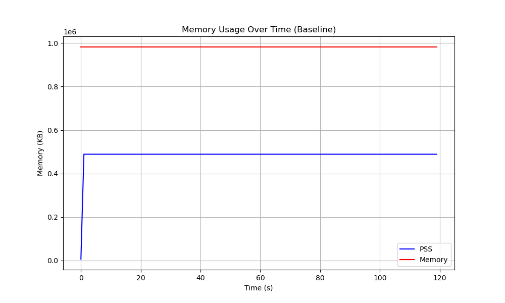
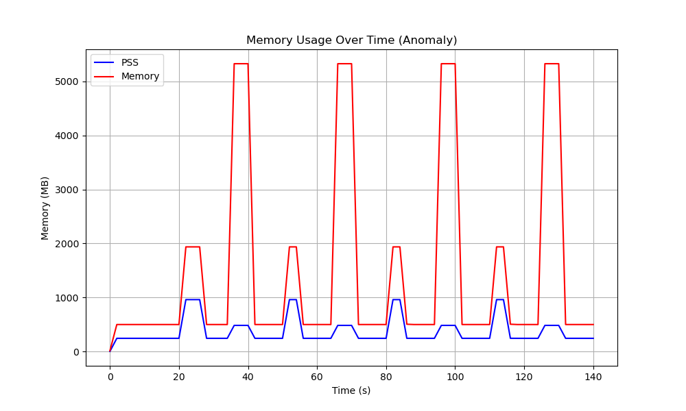
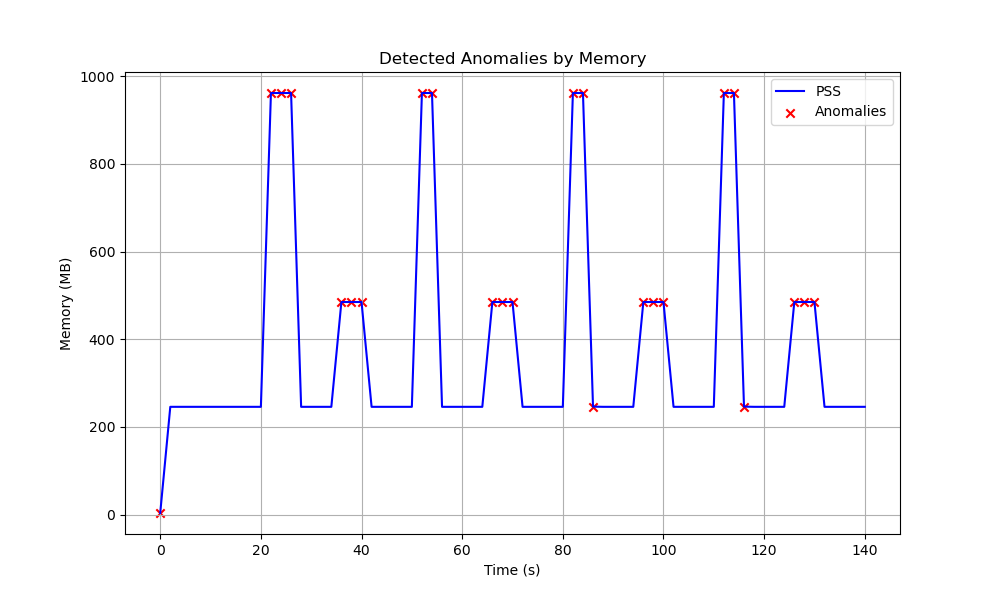

Process Resource Monitoring and Anomaly Detection Task

Overview
This project uses prmon to generate and analyze time-series data from process and resource monitoring. I generated a baseline dataset for memory usage, inject artificial anomalies (from memory draw and process spikes), and successfully identify those anomalies using an unsupervised machine learning (ML) model.

1. Data Generation

Data was collected by using prmon to monitor the acivity of prmon's built-in C++ mem-burner script, used to draw 500MB of memory as a baseline. I sampled this every 1 second for 120 seconds using the following terminal command (in a Linux virtual envirnment):

~/prmon/install/bin/prmon --interval 1 --filename baseline.txt -- /home/ubuntu/prmon/build/package/tests/mem-burner -m 500 -s 120

Graphing the virtual memory and PSS (proportional set size) of the process over time, we see relatively constant consumption rate



(Memory graphs were generated from the output dataset using the simple matplotlib script in plot_memory.py)

To create a repeated pattern of system stress, I injected two distinct types of anomalies several times over a three minute period:
- Memory Spikes: Suddenly allocating an additional 1500MB for 5 seconds.
- Thread/Process Spikes: Spawning 10 concurrent processes that hold 500MB total for 5 seconds.

These anomalies were implemented as additional subprocesses on top of the baseline process running the mem-burner script with different inputs:

```python
# Start baseline process
import subprocess
...

baseline = subprocess.Popen([burner_path, "-m", "500", "-s", "180"])

# Generate anomalies at regular intervals
for i in range(4):
    # Large memory draw
    anomaly = subprocess.Popen([burner_path, "-m", "1500", "-s", "5"])
    time.sleep(15)

    # Starting many processes
    anomaly2 = subprocess.Popen([burner_path, "-m", "500", "-p", "10", "-s", "5"])
    time.sleep(15)
```

This had the following effect on the memory usage:



2. Anomaly Detection

My next goal was to analyze these data using ML to detect the anomalies we introduced artificially. I decided to use the Isolation Forest model from the scikit-learn library, since it performs well on multi-dimensional anomaly detection. This allowed me to pass multiple input features (PSS, virtual memory, # process, # threads), making it more effective on a broader range of possible anomalies. In comparison, a simple statistical threshold (e.g., a Z-score on memory) would be more likely to miss the process-count anomalies.

This method was implemented with the IsolationForest class from scikit-learn in the following code block. We mask the dataframe based on rows determined to be anomalous based on their (pss, vmem, nprocs, nthreads) features. 

```python
from sklearn.ensemble import IsolationForest
...

# Prepare input features
X = df[['pss_mb', 'vmem_mb', 'nprocs', 'nthreads']]

# Fit Isolation Forest model
model = IsolationForest(contamination=0.35, random_state=2)
df['anomaly'] = model.fit_predict(X)
anomalies = df[df['anomaly'] == -1]
```

This program successfully identified anomalous regions in the data (where red X marks represent a detected anomaly point):



3. Evauation

While the Isolation Forest model was effective, there were a few notable limitations. 

In our implementation, the model requires a contamination estimate to specify the expected percentage of anomalies. I initially had this parameter set to 15%, but the model failed to flag all the peaks because the anomaly injections occupied more than 15% of the program duration. Increasing the parameter to 35% resolved this issue, but in a real-world scenario, statically defining this percentage could lead to missed anomalies or false positives. In future cases, we could automatically adjust the contamination rate by setting this parameter to 'auto', although it may reduce the overall accuracy.

Transition States: The model occasionally flagged points at the beginning of a memory spike rather than the peak. These are technically false positives for the peak of the anomaly, but they accurately reflect the anomalous transition of the program from constant to increasing memory usage. 

AI Disclosure
I used Google Gemini 3.1 Pro for the following tasks
- Setting up the Linux virtual environment (Ubuntu) on my Mac and familiarizing myself with the Linux command prompts
- Using methods from the subprocess package to run multiple instances of the mem-burner script simultaneously
- Drafting project documentation outline